# Procesverslag
Markdown is een simpele manier om HTML te schrijven.  
Markdown cheat cheet: [Hulp bij het schrijven van Markdown](https://github.com/adam-p/markdown-here/wiki/Markdown-Cheatsheet).

Nb. De standaardstructuur en de spartaanse opmaak van de README.md zijn helemaal prima. Het gaat om de inhoud van je procesverslag. Besteedt de tijd voor pracht en praal aan je website.

Nb. Door *open* toe te voegen aan een *details* element kun je deze standaard open zetten. Fijn om dat steeds voor de relevante stuk(ken) te doen.

## Jij

  
uitwerken voor kick-off werkgroep

  ### Auteur:
  Jop Molenaar

  #### Je startniveau:
  Rood, maar blauw voor CSS

  #### Je focus:
  responsive maar ik ga ook surface plane doen
 

## Je website

  
uitwerken voor kick-off werkgroep

  ### Je opdracht:
  https://www.loetje.nl/nl/

  #### Screenshot(s) van de eerste pagina (small screen): 
  Welkom bij Loetje  
  

  #### Screenshot(s) van de tweede pagina (small screen):
  Locaties  
  
 

## Toegankelijkheidstest 1/2 (week 1)

  
uitwerken na test in 1e werkgroep

  ### Bevindingen
  Lijst met je bevindingen die in de test naar voren kwamen:
  - De taal staat fout in de html.
  - De screenreader zegt bij de headings alleen banner.
  - De screenreader zegt sommige teksten wel op de banner en sommige niet.
  - Bij #delekkerstebiefstuk zijn de foto's een link 
  - Bij #delekkerstebiefstuk hoor je niet wat de foto is. 
  - Je komt vast te zitten in de popup met de screenreader.
  - Met Tab kan je soms niet goed zien waar je bent.(focus)
  - Bij de menu knopjes kan je helemaal niet zien dat je erop bent met tab.(focus)
  - Je kan met pijltjes alleen naar boven en beneden maar niet naar andere knopjes of links.
  - Menu heeft geen hover en sommige links hebben ook geen hover zoals een "lees meer" veranderd niet op de homepagina van een banner maar "menubeurt" veranderd wel.
  - Kleuren blind gaat gewoon goed.
  - Er is geen darkmode.
  - Elastiek om je vingers is geen probleem.
  - Bril met 2 blokjes: geen probleem.
  - Bril met vlekken: De toets onder de menukaart button kan je bijna niet lezen. Voor de rest is het geen probleem.
  - Bril met blur: niks te lezen.
  - Bril met geel filter: Alles is prima te lezen.
  - Bril met klein doorkijkpunt: links werden wazig waardoor ik bij de locatie pagina helemaal niks kan lezen. Bij de homepagina: kan headings lezen maar kleine tekst niet. Cadeaukaart en bieftsuk 0.0 kopjes is ook mielijk te zien. FAQ is ook moeilijk te lezen maar de kopjes kan ik wel lezen.
  - Ballon(concentratie): De welkom bij loetje tekst is een beetje lang.
  - Parkinson: Je kan alles aanklikken en goed scrollen. Knopjes en links zijn groot genoeg. Bij locaties zijn de locatie's een beetje gevoelig.

  #### Screenreader
  Hier korte omschrijving (met indien nodig afbeeldingen)
  <!-- - De taal staat fout in de html.
  - De screenreader zegt bij de headings alleen banner.
  - De screenreader zegt sommige teksten wel op de banner en sommige niet.
  - Bij #delekkerstebiefstuk zijn de foto's een link 
  - Bij #delekkerstebiefstuk hoor je niet wat de foto is. 
  - Je komt vast te zitten in de popup met de screenreader. -->

- De site kan zeker beter als je een screenreader gebruikt. De taal staat in het engels terwijl de site in het nederlands is en er staan wat alts niet goed.

  Hier een omschrijving van hoe het opgelost kan worden (met indien nodig afbeeldingen)
  
  - De taal goed zetten in de html, wat alts goed maken -> goede omschrijving. 

  #### Muis en Toetsenbord 
  Hier korte omschrijving (met indien nodig afbeeldingen)
  <!-- - Met Tab kan je soms niet goed zien waar je bent.(focus)
  - Bij de menu knopjes kan je helemaal niet zien dat je erop bent met tab.(focus)
  - Je kan met pijltjes alleen naar boven en beneden maar niet naar andere knopjes of links.
  - Menu heeft geen hover en sommige links hebben ook geen hover zoals een "lees meer" veranderd niet op de homepagina van een banner maar "menubeurt" veranderd wel. -->

- De focus state is niet goed ontworpen of ontbreekt, met de pijltjes kan je niet switchen tussen de linkjes, dit kan alleen met tab en hiermee kan je niet terug. Er ontbreken wat hover states.

  Hier een omschrijving van hoe het opgelost kan worden (met indien nodig afbeeldingen)
  - De focus state bij elk element waar je langs kan komen goed herkenbaar maken. Hover states aanmaken, kijken of je ook met pijltjes tussen linkjes kan switchen.

  #### Motoriek (shocks, elastiekjes)
  Hier korte omschrijving (met indien nodig afbeeldingen)
  <!-- - Elastiek om je vingers is geen probleem.
  - Ballon(concentratie): De welkom bij loetje tekst is een beetje lang.
  - Parkinson: Je kan alles aanklikken en goed scrollen. Knopjes en links zijn groot genoeg. Bij locaties zijn de locatie's een beetje gevoelig. -->

- Sommige teksten zijn iets te lang voor mensen met concentratie problemen, en bij de locatie pagina zijn de locatie's een beetje gevoelig. 

  Hier een omschrijving van hoe het opgelost kan worden (met indien nodig afbeeldingen)
- te lange teksten inkorten, overflow-x: snap nog iets op de locatie pagina toepassen.

  #### Visueel (brillen, contrast, kleurenblind, dark/light). 
  Hier korte omschrijving (met indien nodig afbeeldingen)
  

- Er ontbreekt een darkmode, en de brillen met blur, vlekken of kleine doorkijk gaatjes is de kleine tekst niet of erg lastig te lezen. Zeker op de locatie pagina.

  Hier een omschrijving van hoe het opgelost kan worden (met indien nodig afbeeldingen)
- contrast aansterken?, font size vergroten? 

## Breakdownschets (week 1)

  
uitwerken na afloop 2e werkgroep

  ### de hele pagina: 
  

  ### dynamisch deel (bijv menu): 
  

## Voortgang 1 (week 2)

  
uitwerken voor 1e voortgang

  ### Stand van zaken
  Hier dit ging goed & dit was lastig (neem ook screenshots op van delen van je website en code)
  De waardes vinden van bepaalde elementen ging goed maar het positioneren vind ik nog erg lastig, zeker omdat diegene die het heeft gemaakt het totaal niet semantisch in orde heeft gemaakt. Dit zorgt ervoor dat ik met minder middelen hetzelfde moet gaan maken. Vooral de navigatie van de header positioneren (hier gaat ook een vraag over) en eht eerste plaatje in de main vind ik lastig nu. Verder gaat het prima.

  

  

  ### Agenda voor meeting
  samen met je groepje opstellen

  | Jop Molenaar   | Nina               | Liam          | Tijme        |
  | ---            | ---                | ---          | ---           |
  | dit bespreken  | en dit             | Niet aanwezig| Niet aanwezig |
  | en dat ook nog | dit als er tijd is |      .       | .             |
  | ...            | ...                | ...          | ...           |

Jop wil ik bespreken: 
- Cadeaukaart en bieftsuk 0.0 uit de lijst apart maken. (wrap en spacing met div, mag ik dat doen?)
- Mag ik een section plaatsen in de header om m zo te kunnen centreren als de pagina grooter wordt dan ...px
- Moet ik de header afbeelding als background img zetten ipv een img in de html? (zo wordt ie alleen niet opgenoemd door de screenreader denk ik)

Planning: Eerst alle css, terwijl je de css doet ben je bezig met de responsiveness en daarna ga ik pas extra css toepassen (dark mode, :active, :focus, :hover etc)

Nina wil dit bespreken:
Vraag week 2 (vorige week) Vraag? Hoe maak ik de achtergrond van mijn buttons transparent (omdat het foto's zijn in bepaalde vormen  

Antwoord: (HULP JOP) Zet de foto' als linkjes i.p.v buttons hierdoor wordt je achtergrond wel transparent.

  ### Verslag van meeting
  hier na afloop snel de uitkomsten van de meeting vastleggen

  - 2 aparte ul's gebruiken
  - 1 div mag ik gebruiken om zo de header te centreren.
  - position:absolute en verder nog wat dingen waardoor die nu goed staat.
  
  nog wat extra punten: 
  - Het font is hetzelfde nu
  - ik mag geen px gebruiken
  

## Voortgang 2 (week 3)

  
uitwerken voor 2e voortgang

  ### Stand van zaken
  hier dit ging goed & dit was lastig (neem ook screenshots op van delen van je website en code)

  Ik heb hele goede voortgang geboekt. De site ziet er al bijna af uit. Wel heb ik nog wat kleine detail dingetjes die ik zelf niet wist op te lossen want dan zie ik niet precies wat er gebeurt in de code. Verder heb ik een aantal vragen waar ik het antwoord al bijna op weet maar voor de zekerheid ga ik het toch even vragen want wie weet kan je hetzelfde resultaat krijgen op een andere manier. 
  
  
  

  ### Agenda voor meeting
  samen met je groepje opstellen

  | Jop     | Nina         | Liam    | Tijme       |
  | ---            | ---                | ---          | ---              |
  | dit bespreken  | en dit             | en ik dit    | en dan ik dat    |
  | en dat ook nog | dit als er tijd is | nog een punt | dit wil ik zeker |
  | ...            | ...                | ...          | ...              |

Jop wil dit bespreken: 
- De ene li is groter dan de ander als het grid komt in de main, hoe komt dat en hoe fix ik dit?
- Hoe zou ik de vragen buttons kunnen laten uitlklappen?
- Het kopje in de header bestaat uit 2 delen op de echte site. Mag ik dit laten of???
- Hoe kom ik aan de iconen van de socials?
- Moet ik die 5 verschillende foto's bovenaan in de main ook doen?

Nina wil dit bespreken: 
- Vraag 1: Logo staat nu heel raar geplaatst in mijn html, is hier een handigere manier voor?

- Vraag 2: Hoe zet ik uit dat het over elkaar gaat als ik het groter maak? ik heb width: VW gedaan en dat betekent dat het groot word als ik het groter maak en dat moet maar het moet niet over elkaar.

- Vraag 3: Ik loop vast met de achtergrond omdat dat allemaal met css is gedaan, hoe maak ik hier een begin mee?

- Vraag 4: Hoe geef ik een img/link een hover effect? 

Liam wil dit bespreken:

Tijme wil dit bespreken:

- Mag dit: < li >< a >< img >content< img >< a >< li >?
- Ga ik de goeie kant op met mijn radiobuttons?
- 3 verschillende labels?
- is er een manier om je hele site in 1 keer in het midden uit te lijnen?
- custom font: wat doe ik fout?????????
- is het mogelijk om de more knop naar rechts te flexen??

  ### Verslag van meeting
  hier na afloop snel de uitkomsten van de meeting vastleggen

- 100% height en margin-bottom = 0
- met  < details >
- verder vragen aan Sanne.
- de svg uit de html van loetje kopieren
- ja met en foto carrousel met snap type iets, en mss linkjes dat je naar die foto's kan gaan

## Toegankelijkheidstest 2/2 (week 4)

  
uitwerken na test in 8e werkgroep

  ### Bevindingen
  Lijst met je bevindingen die in de test naar voren kwamen (geef ook aan wat er verbeterd is):
  Wat er nog mis is en nog verbeterd kan worden:
  
  De test ging goed. Je kan al zien dat mijn site toegangkelijker is dan de echte site. Dat komt omdat op elk element waar je op kan en zou moeten kunnen hoveren alles states zitten. Ook zijn die states duidelijker dan op de echte site. 
  De screennreader is duidelijk en staat op mijn site in de goede taal.
  Alle alts en aria-labels staan goed dus de mensen die niet goed kunnen zien en een screenreader gebruiken kunnen zich wat voorstellen van mijn site en ze worden niet gek van alle nmmers en dingen die worden opgenoemd als ze op een afbeelding komen zoals op de echte loetje website.

 Natuurlijk kunnen er altijd dingen beter en dat kwam ook uit de test. Die resultaten kan je hieronder zien.

  #### Screenreader

  - Bij de locatie pagina ziet de screenreader niet dat het een telefoonnummer is in de ul naast de map dus leest die dat als een groot getal op.

  Hier een omschrijving van hoe het opgelost kan worden (met indien nodig afbeeldingen)

  - Dit kan opgelost worden met aria-labels. 
   

  #### Muis en Toetsenbord 

  - De tab functie bij het carousel doet het daar heel raar.
  - Bij de pagina "locaties" zijn de locaties geen buttons.
  - De linkjes op de foto's in de eerste sectie van de main hebben geen states.

  Hier een omschrijving van hoe het opgelost kan worden (met indien nodig afbeeldingen)
  - Ik heb een idee hoe ik dit kan oplossen maar daar heb ik wel javascript voor nodig. Dit is geen probleem maar ik heb nu al weer een stukje code maar dat doet het deels wel deels niet. Het doel van dat stukje code is dat het detecteerd wanneer een element in de lijst een focus heeft. En op deze actie komt er een class op de ul waardoor de 4 afbeeldingen worden verdeeld over de eerste sectie in de main waardoor ze allemaal tegelijkertijd te zien zijn. En dus geen rare dingen gebeuren waar content opeens verdwijnt.
  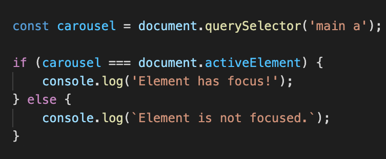
  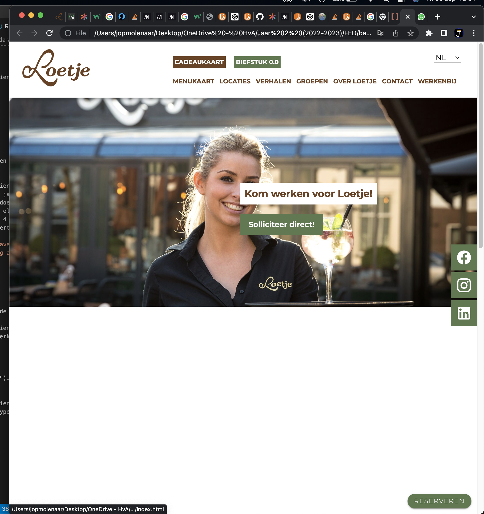

  - Ik heb buttons om content in de li gezet. 
  - Ik heb er states voor geschreven.

  #### Motoriek (shocks, elastiekjes)

  - Met parkinson swipe ik perongeluk naar de locatie's pagina (de vorige pagina eigenlijk).

  Hier een omschrijving van hoe het opgelost kan worden (met indien nodig afbeeldingen)
  -  Dit heb ik op gelost met overscroll-behavior-x: none; het werkt nu wel maar ik moet nog even navragen of dit wel de beste oplossing is en of het wel mag.

  #### Visueel (brillen, contrast, kleurenblind, dark/light). 
  
  - Het kleinste lettertype is nog te klein. ("loetje is 45 jaar").
  - Er is nog geen darkmode.

  Hier een omschrijving van hoe het opgelost kan worden (met indien nodig afbeeldingen)
  - Ik heb ik de @media op verschillende breakpoints het lettertype vergroot. 
  en sowieso het kleinste lettertype 1em gegeven.
  - De darkmode ga ik nog maken.

## Voortgang 3 (week 4)

  
uitwerken voor 3e voortgang

  ### Stand van zaken
  hier dit ging goed & dit was lastig (neem ook screenshots op van delen van je website en code)

  De voortgang gaat prima, heb nog wat laatste dingetjes die ik nog moet oplossen.
  heb niet super veel vooruitgang geboekt met de opmaak van de site maar heb vooral tijd besteedt aan het opruimen van de css.
  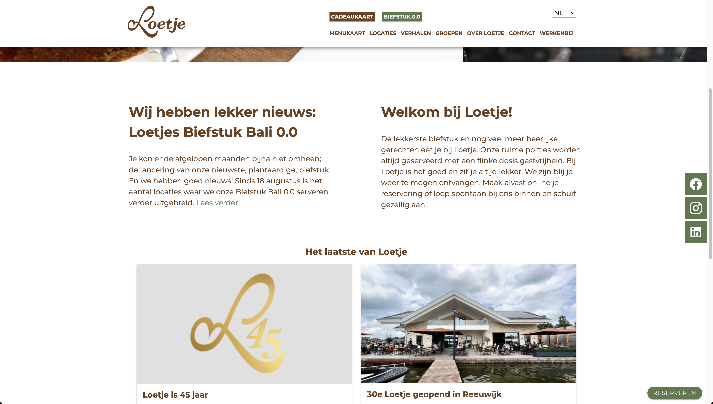
  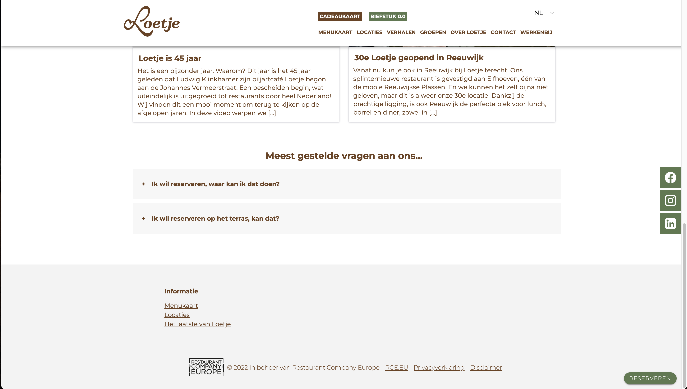
  

  ### Agenda voor meeting
  samen met je groepje opstellen

  | Jop            | Nina               | tijme        | liam             |
  | ---            | ---                | ---          | ---              |
  | dit bespreken  | en dit             | en ik dit    | en dan ik dat    |
  | en dat ook nog | dit als er tijd is | nog een punt | dit wil ik zeker |
  | ...            | ...                | ...          | ...              |

Vragen Jop:
- Ik heb een idee hoe ik dat probleem bij de eerste sectie bij de main kan oplossen maar ik heb nu een stukje code in javascript daarvoor maar dat doet het deels wel deels niet. Het doel van dat stukje code is dat het ziet wanneer een element in de lijst een focus heeft. En op deze actie komt er een class op de ul waardoor de 4 afbeeldingen worden verdeeld over de eerste sectie in de main waardoor ze allemaal tegelijkertijd te zien zijn. En dus geen rare dingen gebeuren waar content opeens verdwijnt.
 -  ik heb overscroll-behavior-x: none; gebruikt, het werkt nu wel maar is dit wel de beste oplossing en mag het wel.

 - de main bugged bij mij.
 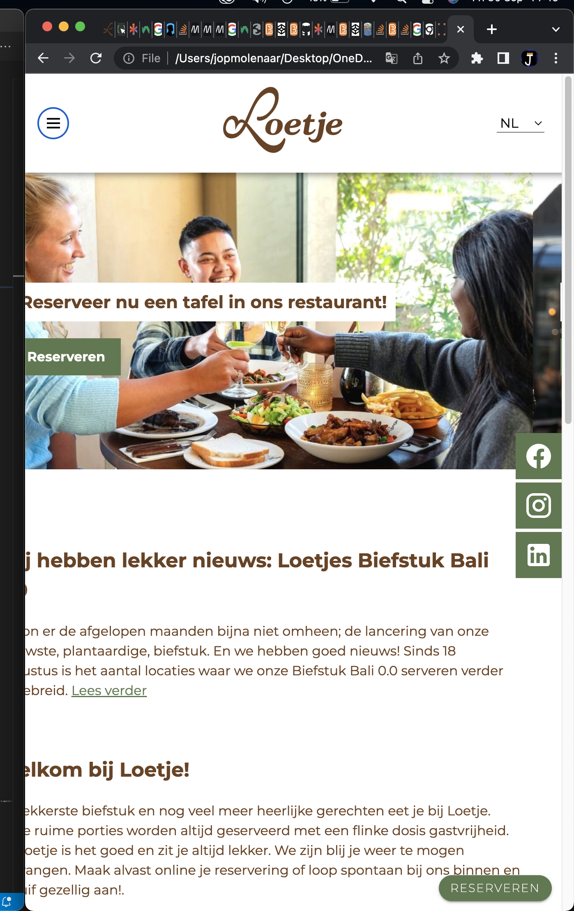
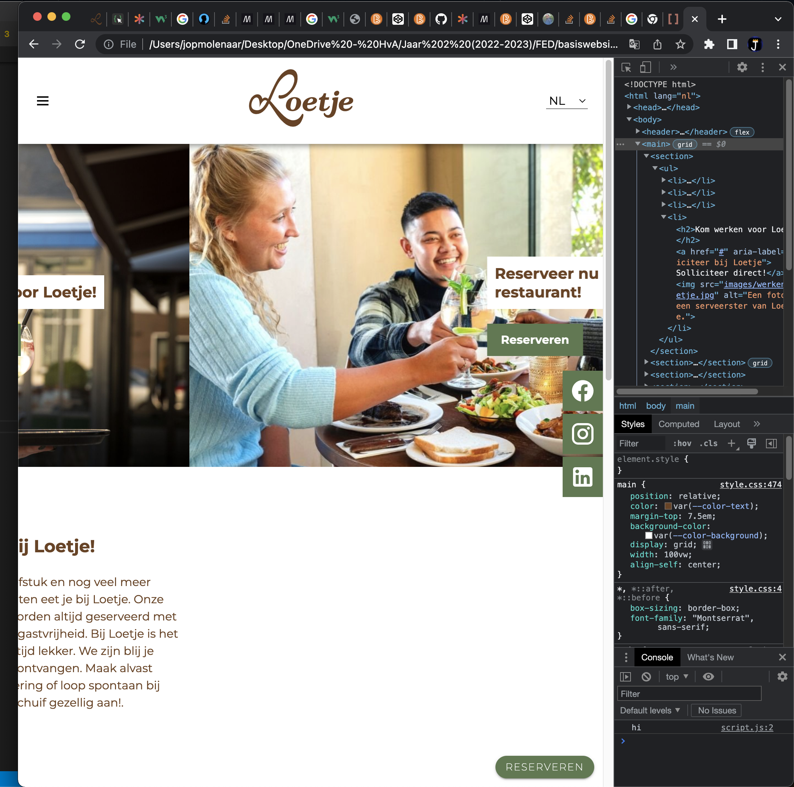

- En ik heb een vraag over dat 1 van de titels aan de kant blijft plakken zoals dit:
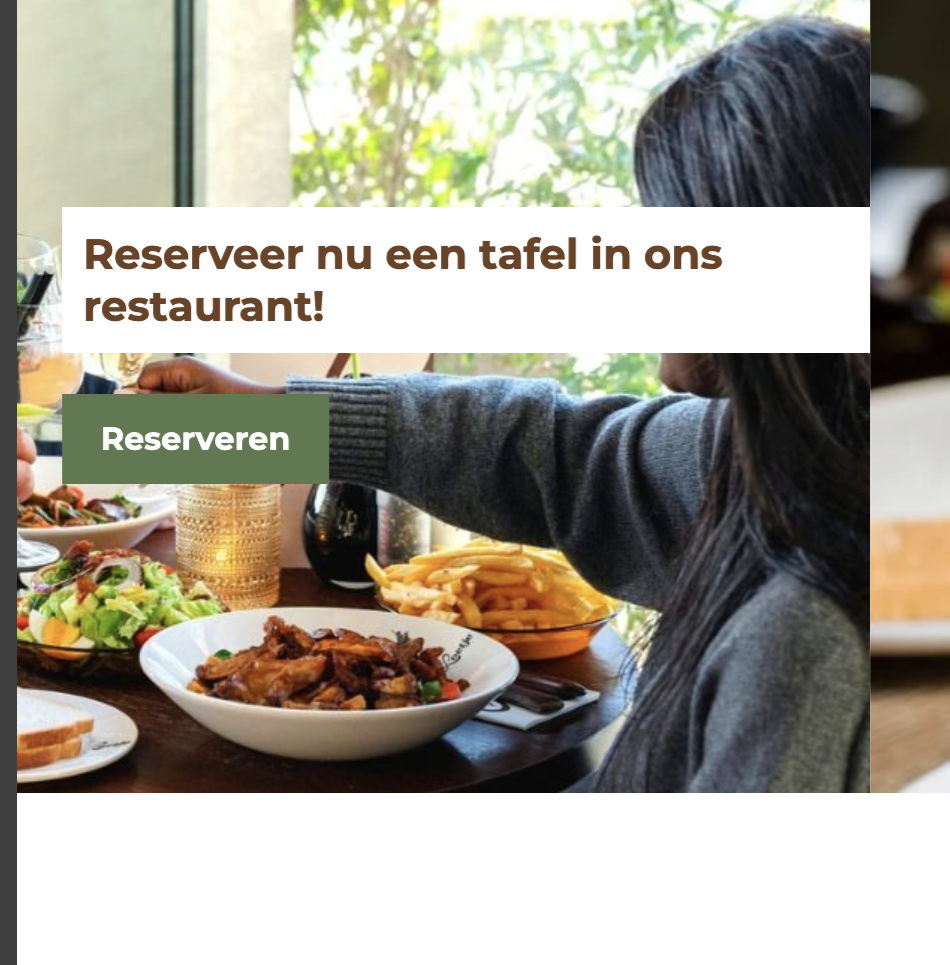

Vragen Nina:
- Background kleur bij mijn 2de pagina moet zwart, ik heb beide mijn body’s een class gegeven alleen het doet gek als ik verander, hoe los ik dit op?
- Hulp bij dark/light mode bij me site, invert of filter voor mijn achtergrond?
- Pijl als je op klikt dat het dan weer naar boven springt (2de pagina)

Vragen Tijme:

- Waarom luistert 1e <li> niet naar justify content en de andere wel?
- Kan een border uitvagen op het einde?
-  Hoe 2 texten in een container uit elkaar zetten? (Mag je 2 html elementen gebruiken?)

Vragen Liam:

  ### Verslag van meeting
  hier na afloop snel de uitkomsten van de meeting vastleggen

  - focus-within
  - Knopje voor maken
  - Nog wat h2 bij de sections gedaan voor de semantiek.
  - ...

## Eindgesprek (week 5)

  
uitwerken voor eindgesprek

  ### Je uitkomst - karakteristiek screenshots:
  
  
    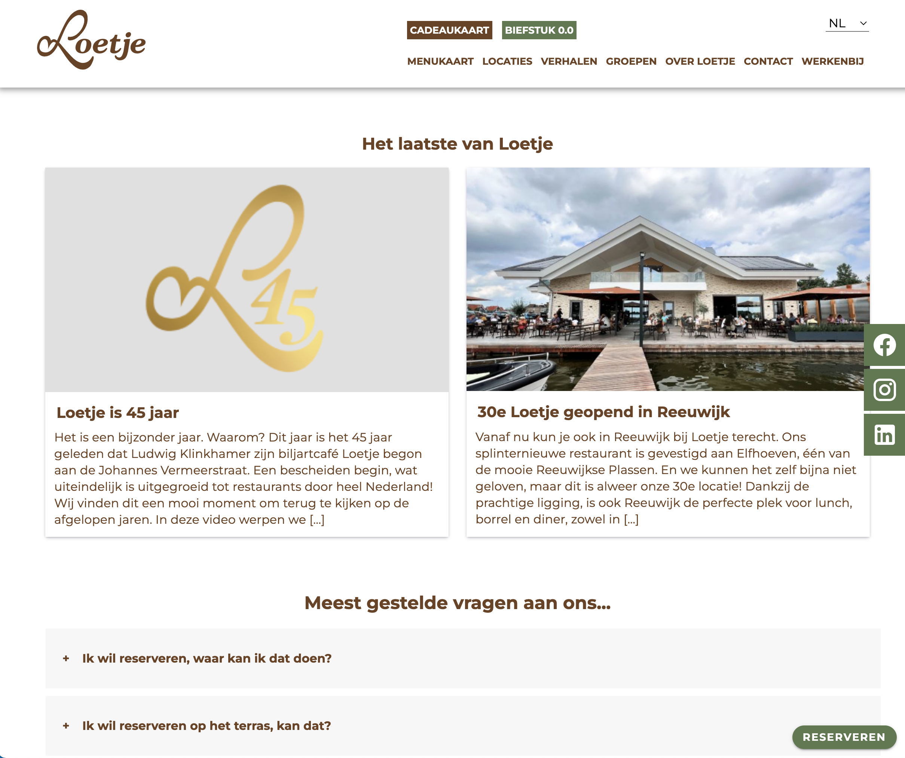
   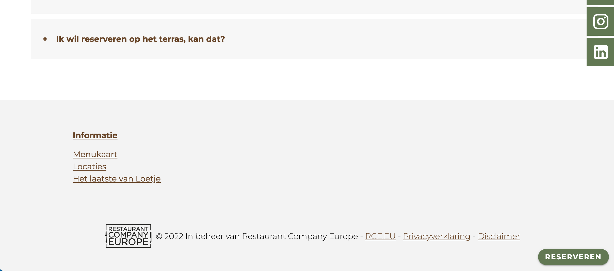

  ### Dit ging goed/Heb ik geleerd: 
  Het coderen ging goed, ik moest even inkomen maar daarna ging hetr snel. Ik heb veel uitgeprobeerd maar niet alles is gelukt. Ik heb meer css geschreven dan vorige vakken dus dat zit nu beter in mijn hoofd en ik heb nieuwe css regels geleerd zoals het gebruik van roots, details en gradients.
  Ook heb ik veel meer geleerd over hoe je nou een website toegankelijk maakt van iedereen en dat ga ik ook zeker gebruiken in de toekomst.

  ### Dit was lastig/Is niet gelukt:
  Ik heb het niet voor melkaar gekregen om nog een uitklap menu bovenin de header met toegankelijkheids knopjes zoals hoog contrast, lettertype vergroten en overscroll-behavior-x uit te zetten voor parkinson. Het menu'tje was er wel maar het deed heel raar met focussen en uitklappen. Ook was het contrast maken met hovers moeilijk in de hoge contrast modes. en de lettertypes vergroten kreeg ik niet voor melkaar. Ik heb een studente assistent gevraagt mij te helpen maar dat lukte haar ook niet. O0k was mijn tijd bijna voorbij dus heb ik alles maar verwijderd om het nog netjes te maken. Dit stond in de header en ik heb wat foto's hoe het eruit zag:

< section >
			<h2 class="visually-hidden">Toegankelijkheid menu</h2>

			<button aria-label="open toegankelijkheid menu" >
				
				
				
			</button>

			<button>Hoog contrast</button>
			<button>Overflow-x uit</button>
		< / section >

 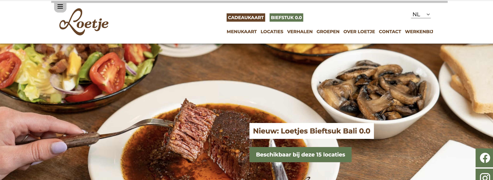
 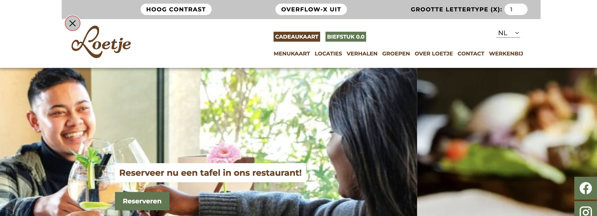
        

Ook heb ik nog problemen met dat de linkjes eerst foccussen als je erop klikt waardoor je er niet op kan klikken. geen idee hoe dat komt.
  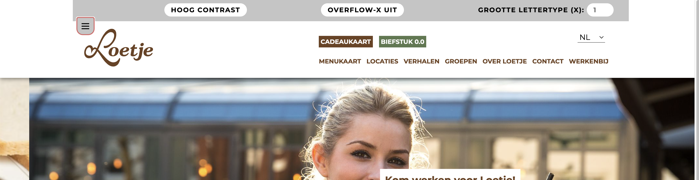

## Bronnenlijst

  
continu bijhouden terwijl je werkt

  Nb. Wees specifiek ('css-tricks' als bron is bijv. niet specifiek genoeg).
  
  1. carousel: https://css-tricks.com/css-only-carousel/
  2. map: https://google-map-generator.com/
  3. hover in nav: https://codepen.io/shooft/pen/qBogPoM?editors=1100
  4. shadows: https://getcssscan.com/css-box-shadow-examples
  5. hamburgermenu button: https://codepen.io/shooft/pen/dymRMBZ
  6. list style: https://developer.mozilla.org/en-US/docs/Web/CSS/list-style-type
  7. hide h2 https://codepen.io/shooft/pen/rNvJyov

