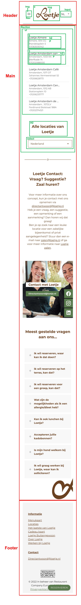
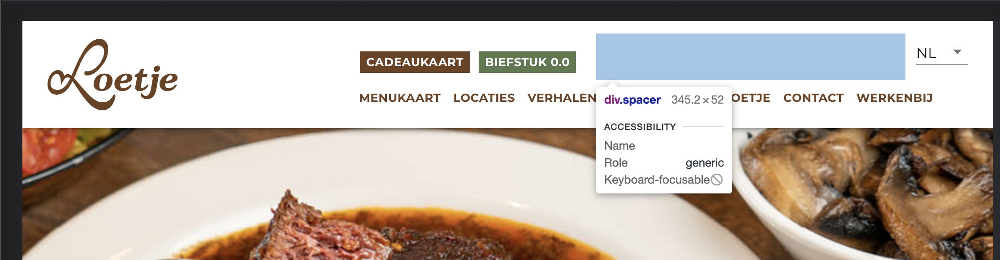
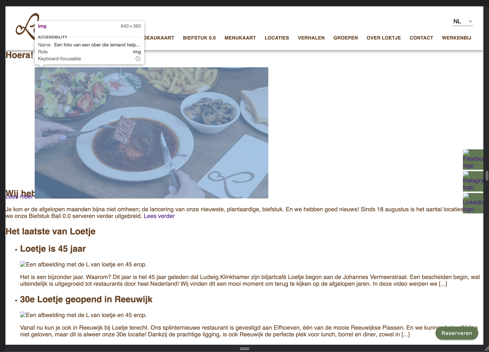

# Procesverslag
Markdown is een simpele manier om HTML te schrijven.  
Markdown cheat cheet: [Hulp bij het schrijven van Markdown](https://github.com/adam-p/markdown-here/wiki/Markdown-Cheatsheet).

Nb. De standaardstructuur en de spartaanse opmaak van de README.md zijn helemaal prima. Het gaat om de inhoud van je procesverslag. Besteedt de tijd voor pracht en praal aan je website.

Nb. Door *open* toe te voegen aan een *details* element kun je deze standaard open zetten. Fijn om dat steeds voor de relevante stuk(ken) te doen.

## Jij

  
uitwerken voor kick-off werkgroep

  ### Auteur:
  Jop Molenaar

  #### Je startniveau:
  Rood, maar blauw voor CSS

  #### Je focus:
  surface plane maar ik wil responsive ook doen.
 

## Je website

  
uitwerken voor kick-off werkgroep

  ### Je opdracht:
  https://www.loetje.nl/nl/

  #### Screenshot(s) van de eerste pagina (small screen): 
  Welkom bij Loetje  
  

  #### Screenshot(s) van de tweede pagina (small screen):
  Locaties  
  
 

## Toegankelijkheidstest 1/2 (week 1)

  
uitwerken na test in 1e werkgroep

  ### Bevindingen
  Lijst met je bevindingen die in de test naar voren kwamen:
  - De taal staat fout in de html.
  - De screenreader zegt bij de headings alleen banner.
  - De screenreader zegt sommige teksten wel op de banner en sommige niet.
  - Bij #delekkerstebiefstuk zijn de foto's een link 
  - Bij #delekkerstebiefstuk hoor je niet wat de foto is. 
  - Je komt vast te zitten in de popup met de screenreader.
  - Met Tab kan je soms niet goed zien waar je bent.(focus)
  - Bij de menu knopjes kan je helemaal niet zien dat je erop bent met tab.(focus)
  - Je kan met pijltjes alleen naar boven en beneden maar niet naar andere knopjes of links.
  - Menu heeft geen hover en sommige links hebben ook geen hover zoals een "lees meer" veranderd niet op de homepagina van een banner maar "menubeurt" veranderd wel.
  - Kleuren blind gaat gewoon goed.
  - Er is geen darkmode.
  - Elastiek om je vingers is geen probleem.
  - Bril met 2 blokjes: geen probleem.
  - Bril met vlekken: De toets onder de menukaart button kan je bijna niet lezen. Voor de rest is het geen probleem.
  - Bril met blur: niks te lezen.
  - Bril met geel filter: Alles is prima te lezen.
  - Bril met klein doorkijkpunt: links werden wazig waardoor ik bij de locatie pagina helemaal niks kan lezen. Bij de homepagina: kan headings lezen maar kleine tekst niet. Cadeaukaart en bieftsuk 0.0 kopjes is ook mielijk te zien. FAQ is ook moeilijk te lezen maar de kopjes kan ik wel lezen.
  - Ballon(concentratie): De welkom bij loetje tekst is een beetje lang.
  - Parkinson: Je kan alles aanklikken en goed scrollen. Knopjes en links zijn groot genoeg. Bij locaties zijn de locatie's een beetje gevoelig.

  #### Screenreader
  Hier korte omschrijving (met indien nodig afbeeldingen)
  <!-- - De taal staat fout in de html.
  - De screenreader zegt bij de headings alleen banner.
  - De screenreader zegt sommige teksten wel op de banner en sommige niet.
  - Bij #delekkerstebiefstuk zijn de foto's een link 
  - Bij #delekkerstebiefstuk hoor je niet wat de foto is. 
  - Je komt vast te zitten in de popup met de screenreader. -->

- De site kan zeker beter als je een screenreader gebruikt. De taal staat in het engels terwijl de site in het nederlands is en er staan wat alts niet goed.

  Hier een omschrijving van hoe het opgelost kan worden (met indien nodig afbeeldingen)
  
  - De taal goed zetten in de html, wat alts goed maken -> goede omschrijving. 

  #### Muis en Toetsenbord 
  Hier korte omschrijving (met indien nodig afbeeldingen)
  <!-- - Met Tab kan je soms niet goed zien waar je bent.(focus)
  - Bij de menu knopjes kan je helemaal niet zien dat je erop bent met tab.(focus)
  - Je kan met pijltjes alleen naar boven en beneden maar niet naar andere knopjes of links.
  - Menu heeft geen hover en sommige links hebben ook geen hover zoals een "lees meer" veranderd niet op de homepagina van een banner maar "menubeurt" veranderd wel. -->

- De focus state is niet goed ontworpen of ontbreekt, met de pijltjes kan je niet switchen tussen de linkjes, dit kan alleen met tab en hiermee kan je niet terug. Er ontbreken wat hover states.

  Hier een omschrijving van hoe het opgelost kan worden (met indien nodig afbeeldingen)
  - De focus state bij elk element waar je langs kan komen goed herkenbaar maken. Hover states aanmaken, kijken of je ook met pijltjes tussen linkjes kan switchen.

  #### Motoriek (shocks, elastiekjes)
  Hier korte omschrijving (met indien nodig afbeeldingen)
  <!-- - Elastiek om je vingers is geen probleem.
  - Ballon(concentratie): De welkom bij loetje tekst is een beetje lang.
  - Parkinson: Je kan alles aanklikken en goed scrollen. Knopjes en links zijn groot genoeg. Bij locaties zijn de locatie's een beetje gevoelig. -->

- Sommige teksten zijn iets te lang voor mensen met concentratie problemen, en bij de locatie pagina zijn de locatie's een beetje gevoelig. 

  Hier een omschrijving van hoe het opgelost kan worden (met indien nodig afbeeldingen)
- te lange teksten inkorten, overflow-x: snap nog iets op de locatie pagina toepassen.

  #### Visueel (brillen, contrast, kleurenblind, dark/light). 
  Hier korte omschrijving (met indien nodig afbeeldingen)
  <!-- - Bril met 2 blokjes: geen probleem.
  - Bril met vlekken: De toets onder de menukaart button kan je bijna niet lezen. Voor de rest is het geen probleem.
  - Bril met blur: niks te lezen.
  - Bril met geel filter: Alles is prima te lezen.
  - Bril met klein doorkijkpunt: links werden wazig waardoor ik bij de locatie pagina helemaal niks kan lezen. Bij de homepagina: kan headings lezen maar kleine tekst niet. Cadeaukaart en bieftsuk 0.0 kopjes is ook mielijk te zien. FAQ is ook moeilijk te lezen maar de kopjes kan ik wel lezen.
  - Kleuren blind gaat gewoon goed.
  - Er is geen darkmode. -->

- Er ontbreekt een darkmode, en de brillen met blur, vlekken of kleine doorkijk gaatjes is de kleine tekst niet of erg lastig te lezen. Zeker op de locatie pagina.

  Hier een omschrijving van hoe het opgelost kan worden (met indien nodig afbeeldingen)
- contrast aansterken?, font size vergroten? 

## Breakdownschets (week 1)

  
uitwerken na afloop 2e werkgroep

  ### de hele pagina: 
  

  ### dynamisch deel (bijv menu): 
  

## Voortgang 1 (week 2)

  
uitwerken voor 1e voortgang

  ### Stand van zaken
  Hier dit ging goed & dit was lastig (neem ook screenshots op van delen van je website en code)
  De waardes vinden van bepaalde elementen ging goed maar het positioneren vind ik nog erg lastig, zeker omdat diegene die het heeft gemaakt het totaal niet semantisch in orde heeft gemaakt. Dit zorgt ervoor dat ik met minder middelen hetzelfde moet gaan maken. Vooral de navigatie van de header positioneren (hier gaat ook een vraag over) en eht eerste plaatje in de main vind ik lastig nu. Verder gaat het prima.

  

  

  ### Agenda voor meeting
  samen met je groepje opstellen

  | Jop Molenaar   | student 2          | student 3    | student 4        |
  | ---            | ---                | ---          | ---              |
  | dit bespreken  | en dit             | en ik dit    | en dan ik dat    |
  | en dat ook nog | dit als er tijd is | nog een punt | dit wil ik zeker |
  | ...            | ...                | ...          | ...              |

Dit wil ik bespreken: 
Cadeaukaart en bieftsuk 0.0 uit de lijst apart maken. (wrap en spacing met div, mag ik dat doen?)
Mag ik een section plaatsen in de header om m zo te kunnen centreren als de pagina grooter wordt dan ...px
Moet ik de header afbeelding als background img zetten ipv een img in de html? (zo wordt ie alleen niet opgenoemd door de screenreader denk ik)

Planning: Eerst alle css, terwijl je de css doet ben je bezig met de responsiveness en daarna ga ik pas extra css toepassen (dark mode, :active, :focus, :hover etc)

  ### Verslag van meeting
  hier na afloop snel de uitkomsten van de meeting vastleggen

  - punt 1
  - punt 2
  - nog een punt
  - ...

## Voortgang 2 (week 3)

  
uitwerken voor 2e voortgang

  ### Stand van zaken
  hier dit ging goed & dit was lastig (neem ook screenshots op van delen van je website en code)

  ### Agenda voor meeting
  samen met je groepje opstellen

  | student 1      | student 2          | student 3    | student 4        |
  | ---            | ---                | ---          | ---              |
  | dit bespreken  | en dit             | en ik dit    | en dan ik dat    |
  | en dat ook nog | dit als er tijd is | nog een punt | dit wil ik zeker |
  | ...            | ...                | ...          | ...              |

  ### Verslag van meeting
  hier na afloop snel de uitkomsten van de meeting vastleggen

  - punt 1
  - punt 2
  - nog een punt
- ...

## Toegankelijkheidstest 2/2 (week 4)

  
uitwerken na test in 8e werkgroep

  ### Bevindingen
  Lijst met je bevindingen die in de test naar voren kwamen (geef ook aan wat er verbeterd is):

  #### Screenreader
  Hier korte omschrijving (met indien nodig afbeeldingen)

  Hier een omschrijving van hoe het opgelost kan worden (met indien nodig afbeeldingen)

  #### Muis en Toetsenbord 
  Hier korte omschrijving (met indien nodig afbeeldingen)

  Hier een omschrijving van hoe het opgelost kan worden (met indien nodig afbeeldingen)

  #### Motoriek (shocks, elastiekjes)
  Hier korte omschrijving (met indien nodig afbeeldingen)

  Hier een omschrijving van hoe het opgelost kan worden (met indien nodig afbeeldingen)

  #### Visueel (brillen, contrast, kleurenblind, dark/light). 
  Hier korte omschrijving (met indien nodig afbeeldingen)

  Hier een omschrijving van hoe het opgelost kan worden (met indien nodig afbeeldingen)

## Voortgang 3 (week 4)

  
uitwerken voor 3e voortgang

  ### Stand van zaken
  hier dit ging goed & dit was lastig (neem ook screenshots op van delen van je website en code)

  ### Agenda voor meeting
  samen met je groepje opstellen

  | student 1      | student 2          | student 3    | student 4        |
  | ---            | ---                | ---          | ---              |
  | dit bespreken  | en dit             | en ik dit    | en dan ik dat    |
  | en dat ook nog | dit als er tijd is | nog een punt | dit wil ik zeker |
  | ...            | ...                | ...          | ...              |

  ### Verslag van meeting
  hier na afloop snel de uitkomsten van de meeting vastleggen

  - punt 1
  - punt 2
  - nog een punt
  - ...

## Eindgesprek (week 5)

  
uitwerken voor eindgesprek

  ### Je uitkomst - karakteristiek screenshots:
  

  ### Dit ging goed/Heb ik geleerd: 
  Korte omschrijving met plaatjes

  

  ### Dit was lastig/Is niet gelukt:
  Korte omschrijving met plaatjes

  

## Bronnenlijst

  
continu bijhouden terwijl je werkt

  Nb. Wees specifiek ('css-tricks' als bron is bijv. niet specifiek genoeg).

  1. bron 1
  2. bron 2
  3. ...

